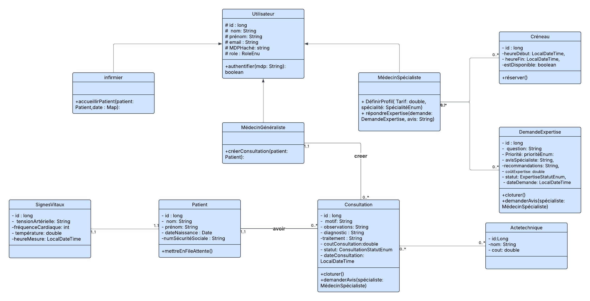

# 🏥 Système de Télé-expertise Médicale (TeleExpertiseMedicale)

Ce projet est un système web de gestion du parcours patient et de coordination à distance entre les Médecins Généralistes (MG) et les Médecins Spécialistes. Il implémente la télé-expertise synchrone et asynchrone pour optimiser la qualité et la rapidité des soins.

---

## 💻 1. Exigences Techniques

Le projet est basé sur l'écosystème Java Enterprise et utilise Maven pour la gestion des dépendances.

| Composant | Version / Technologie | Rôle |
| :--- | :--- | :--- |
| **Langage** | Java 17+ | Core de l'application. |
| **Build** | Maven (version 3.x) | Gestion des dépendances et packaging `.war`. |
| **Serveur** | Apache Tomcat 10.x | Conteneur de Servlets (compatible Jakarta EE 9+). |
| **Persistance** | JPA / Hibernate 6.x | Mapping Objet-Relationnel. |
| **Base de Données** | PostgreSQL | SGBD relationnel. |
| **Web** | JAKARTA EE (Servlet/JSP/JSTL) | Couche de présentation et contrôleurs. |
| **Sécurité** | BCrypt | Hachage des mots de passe. |
| **Tests** (Planifiés) | JUnit 5 / Mockito | Tests unitaires (DAO et Service). |

---

## 🚀 2. Démarrage Rapide et Déploiement

Pour déployer et exécuter l'application localement, suivez ces étapes :

### 2.1. Configuration de la Base de Données (PostgreSQL)

1.  **Installation :** Assurez-vous que PostgreSQL est installé et en cours d'exécution.
2.  **Création DB :** Créez une nouvelle base de données nommée exactement : `teleexpertise_db`
3.  **Mise à jour des identifiants :** Vérifiez et mettez à jour les informations de connexion dans le fichier `src/main/resources/META-INF/persistence.xml` (surtout le `password="root"`).

### 2.2. Initialisation du Schéma et des Données

Au premier lancement, Hibernate gère la création des tables et l'insertion des données de test :

1.  **Création du Schéma :** La propriété `hibernate.hbm2ddl.auto="create"` dans `persistence.xml` crée toutes les tables (`utilisateur`, `patient`, `consultation`, etc.) à partir des classes `@Entity`.
2.  **Insertion des Données :** Le script `src/main/resources/import.sql` insère automatiquement les comptes de test et les actes techniques.

### 2.3. Compilation et Lancement

1.  **Empaquetage (Génération du WAR) :**
    ```bash
    # Exécutez cette commande dans le terminal (ou via le cycle de vie Maven)
    mvn clean package
    ```
    Ceci génère le fichier `TeleExpertiseMedicale-1.0-SNAPSHOT.war` dans le dossier `target/`.
2.  **Déploiement sur Tomcat :**
    * Démarrez votre instance d'Apache Tomcat (version 10+).
    * Déployez le fichier `.war` généré dans le dossier `webapps` de Tomcat, ou lancez l'application via la configuration locale d'IntelliJ.
3.  **Accès :**
    * Ouvrez votre navigateur à l'adresse : `http://localhost:8080/teleexpertise/login`

---

## 🔑 3. Comptes Utilisateurs de Test

Utilisez ces identifiants pour tester les différents modules (mot de passe pour tous : **`password123`**).

| Rôle | Email (Login) | Rôle Testé (TICKET) |
| :--- | :--- | :--- |
| **Infirmier** | `sophie.dupont@hopital.com` | US1 & US2 (Accueil Patient & File d'attente) |
| **Généraliste** | `pierre.martin@hopital.com` | US-GEN-1/US3/US4 (Consultation & Demande Expertise) |
| **Spécialiste** | `anne.legrand@hopital.com` | US5/US6/US7/US8 (Profil, Créneaux & Réponse Expertise) |

---

## 4. Architecture et Modélisation (UML)

L'application suit une architecture MVC (Modèle-Vue-Contrôleur) légère (Servlets comme contrôleurs) avec une séparation stricte des couches DAO (accès DB) et Service (logique métier).

### Diagramme de Classes


``


---

## 5. Fonctionnalités Implémentées (US Validées)

| Module | US | Exigence Validée |
| :--- | :--- | :--- |
| **AUTHENTIFICATION** | US-AUTH | Login/Logout sécurisé (BCrypt) et gestion des sessions/rôles. |
| **INFIRMIER** | US1/US2 | Accueil Patient, enregistrement des Signes Vitaux, et affichage de la file d'attente triée. |
| **GÉNÉRALISTE** | US-GEN-1 | Démarrage, édition et clôture de consultation (Scénario A). |
| **GÉNÉRALISTE** | US-GEN-3/US4 | Recherche de spécialistes (Stream API: filtre/tri par tarif), création de la Demande d'Expertise (Scénario B). |
| **SPÉCIALISTE** | US5/US6/US7/US8 | Configuration du profil, génération des créneaux, consultation des demandes, et réponse (clôture de l'expertise). |